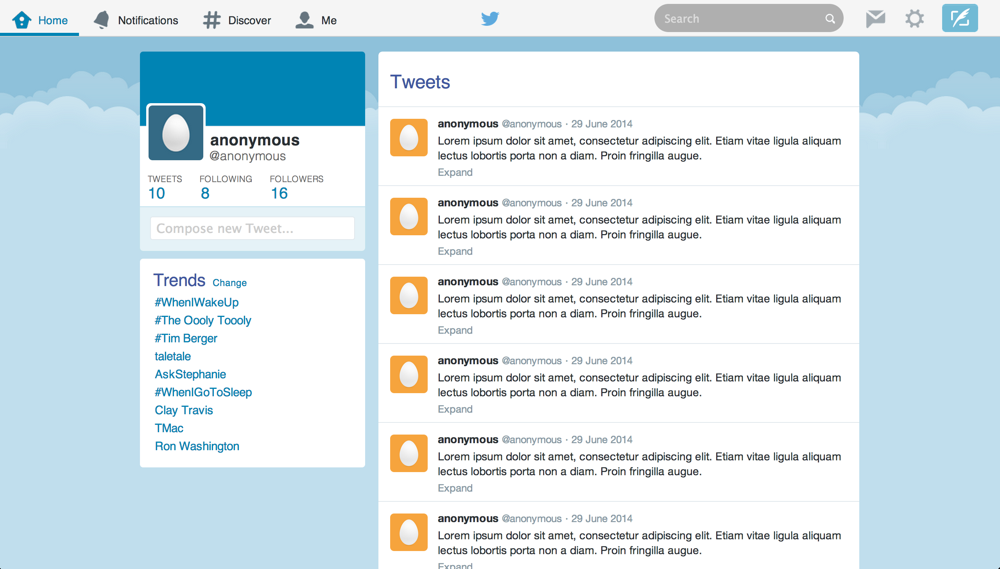

#Twitter Demo

##Makers Academy | Week 8 | Challenge


## Table of Contents

* [Screenshot](#screenshot)
* [General Description](#general-description)
* [Guidelines](#guidelines)
* [See it Live on Github](#see-it-live-on-github)
* [How to Run Locally](#how-to-run-locally)
* [Browsers](#browsers)


##Screenshot

<a href="https://raw.githubusercontent.com/nadavmatalon/twitter_demo/master/javascript/public/images/twitter_demo_screenshot.png">
	
</a>


##General Description

This repo contians my answer to __Week 8 Friday Challange__ as part 
of the course at [Makers Academy](http://www.makersacademy.com/).

This frontpage mockup of [Twitter](https://twitter.com) was written over 
a weekend as a test exercise in working with responsive 
[HTML](http://www.w3schools.com/html/html5_intro.asp) content, 
[CSS](http://www.w3schools.com/css/css3_intro.asp) styling, and basic [Javascript](http://en.wikipedia.org/wiki/JavaScript) 
functionality.


##Guidelines

The guidlines for creating the mockup website were:

* To recreate the front-end of Twitter's feed page as close as possible to the real thing.
* This requires only HTML, CSS and JS (No need to create anything at the back-end)
* The mock-site should look good on the desktop. As a minimum it should have the header and 
  the list of tweets
* JavaScript functionality for infinite scrolling (using dummy data, no server-side content), 
  which will add more tweets when scrolling to the bottom of the page (with a spinner showing
  up and disappearing in-between).
* The mock-site should be responsive.


##See it Live on Github

A live version of the app can be found at:

[Twitter Demo on Github.io](http://nadavmatalon.github.io/twitter_demo/)

(Please see notes about browser compatibility below).


##How to Run Locally

Clone the repo to a locall folder and in the terminal run:

```bash
$> cd twitter_demo
$> bundle install
$> shotgun
```

Then open the browser of your choice and go to:
```
http://localhost:9393/
```

##Browsers

This mock-site was created to support the following browsers (though it should hopefully 
look ok in other browsers as well):

* __Google Chrome__ (36.0)
* __Apple Safari__ (7.0.5)


